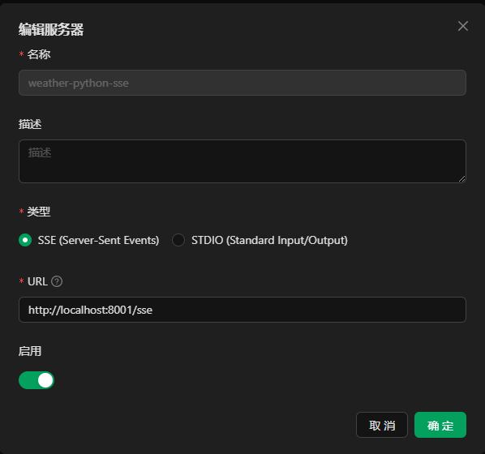
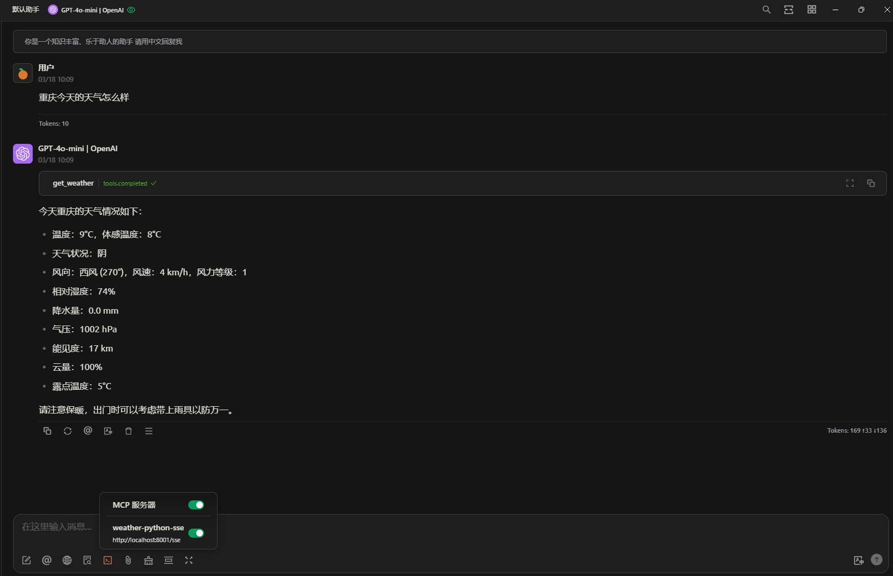

# 🌦️ Weather MCP Server

## 📖 项目简介
这是一个基于 MCP（Minecraft Control Protocol）协议开发的天气信息服务端，通过和风天气 API 实时获取气象数据。

## 🚀 主要功能
- 🌍 获取指定城市的实时天气信息。
- ☁️ 支持通过和风天气API获取天气数据。
- 📊 提供详细的天气信息，包括温度、湿度、风速、降水量等。

## 📋 环境要求
- Python 3.13.2
- Docker (可选，如果使用Docker部署)
- 和风天气API密钥

## 🔧 安装步骤

### 🐳 通过Docker运行

1. **构建Docker镜像**
```bash
docker build -t weather-mcp-server .
```

2. **运行Docker容器**
```bash
docker run -d -p 8000:8000 -e WEATHER_API_KEY=你的API密钥 weather-mcp-server
```

### 环境变量
| 变量名 | 说明 | 必填 |
|--------|------|------|
| WEATHER_API_KEY | 和风天气API密钥 | 是 |

## 在CherryStudio中使用

1. **配置MCP服务器**

在CherryStudio中,打开设置页面,找到"MCP服务器"选项卡。



填写以下信息:
- 服务器地址: `http://你的服务器IP:8000`
- 选择SSE模式

点击"确定"完成配置。


2. **在对话中询问天气**



## 📄 许可证
本项目采用 MIT 许可证。详情请见 [LICENSE](LICENSE) 文件。

## 🙏 致谢
- [和风天气](https://www.qweather.com/) - 提供天气数据API